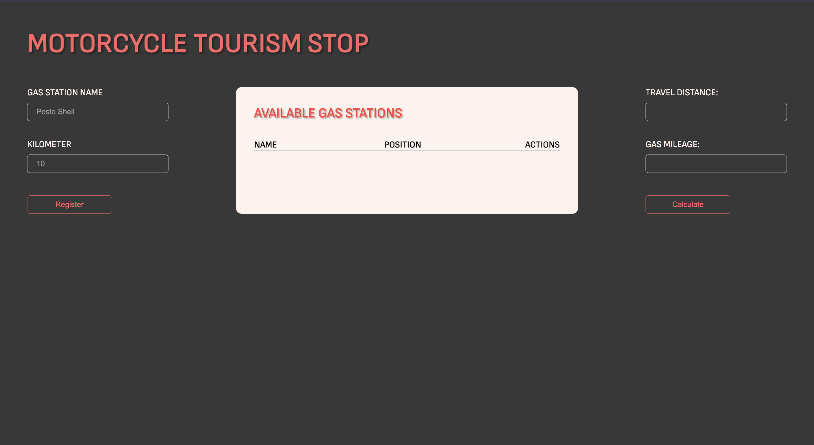
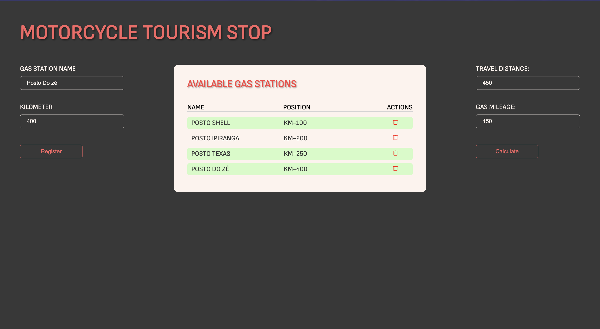
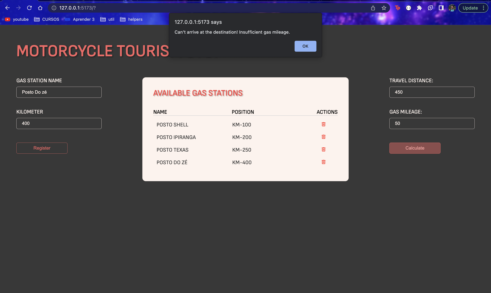
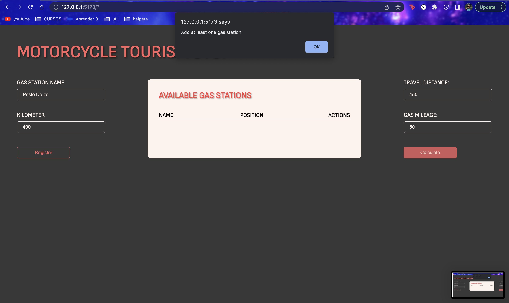

# MOTORCYCLE TOURISM STOP

**Número da Lista**: 36<br>
**Conteúdo da Disciplina**: Greed<br>

## Alunos
| Matrícula | Aluno                                                |
| --------- | ---------------------------------------------------- |
| 170144488 | [Henrique Melo](https://github.com/HenriqueAmorim20) |
| 180122258 | [Igor Queiroz Lima](https://github.com/igorq937)     |

## Sobre
A partir de uma lista de postos que podem ser cadastrados, uma autonomia e qual a distância a ser percorrida, é mostrado ao usuário quais postos ele precisa parar para chegar ao seu destino.

## Apresentação
https://github.com/projeto-de-algoritmos/Greed_MotorcycleTourismStop/blob/master/video.mp4

## Screenshots
</br>
</br>
</br>
</br>

## Instalação 
**Linguagem**: Javascript<br>
**Framework**: ReactJS (Biblioteca)<br>

O projeto está disponível em: https://greed-motorcycle-tourism-stop.vercel.app/

Ou com o **[Node.JS](https://nodejs.org)** instalado, execute os comandos dentro da pasta do projeto:

```bash
npm install
npm run dev
# Tecle Control + C para encerrar
```

Ou se preferir, com o **[Docker](https://www.docker.com/)** instalado, execute os comandos dentro da pasta do projeto:

```bash
docker build -t motocycle-tourism-stop .
docker run -d -p 5173:5173 --name motocycle-tourism-stop motocycle-tourism-stop
```

Utilize o comando abaixo para encerrar a utilização do Docker:

```bash
docker stop motocycle-tourism-stop
```
